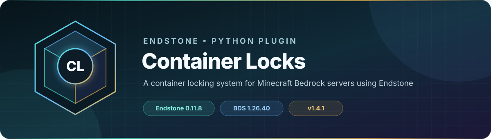

<!-- endstone-professional-header:start -->
<p align="center">
  
</p>

<p align="center">
  <a href="https://github.com/TheNINJALLO/endstone-container-locks/actions/workflows/wheel-release.yml"></a>
  <a href="https://github.com/TheNINJALLO/endstone-container-locks/releases/latest"></a>
</p>

<p align="center">
  
  
  
  =3.10" src="https://img.shields.io/badge/Python-%3E=3.10-3776AB?style=flat-square&amp;logo=python&amp;logoColor=white">
</p>

<p align="center">
  <strong>A container locking system for Minecraft Bedrock servers using Endstone.</strong>
</p>

<p align="center">
  <a href="#overview">Overview</a> &bull;
  <a href="#compatibility">Compatibility</a> &bull;
  <a href="#install">Install</a> &bull;
  <a href="https://github.com/TheNINJALLO/endstone-container-locks/releases">Releases</a>
</p>

## Overview

A container locking system for Minecraft Bedrock servers using Endstone. This release is aligned with Endstone 0.11.8 and Minecraft Bedrock Dedicated Server 1.26.40, and is distributed as a Python wheel for direct installation in an Endstone server.

## Capabilities

-

## Compatibility

| Component | Supported version |
|---|---|
| Endstone | `0.11.8` |
| Endstone API | `0.11` |
| Bedrock Dedicated Server | `1.26.40` |
| Python | `>=3.10` |
| Plugin release | `v1.4.1` |

## Install

Download the wheel from the matching GitHub release:

```bash
gh release download v1.4.1 --repo TheNINJALLO/endstone-container-locks --pattern "*.whl"
```

Copy the downloaded wheel into the server's `plugins/` directory, remove any older wheel for the same plugin, and restart Endstone.

> [!IMPORTANT]
> Use Endstone `0.11.8` with BDS `1.26.40`. Back up worlds and plugin data before upgrading a production server.

## Configuration and secrets

Runtime databases, logs, local `.env` files, server directories, and root `config.toml` files are excluded from source releases. When an example configuration is provided, copy it locally and keep live tokens, passwords, webhook URLs, and server identifiers out of Git.

## Release automation

Every `v*` tag runs [the wheel release workflow](.github/workflows/wheel-release.yml), builds the package in a clean GitHub runner, stores the wheel as a workflow artifact, and attaches it to the matching GitHub release.
<!-- endstone-professional-header:end -->

---

## Project guide

A comprehensive container locking system for Minecraft Bedrock Edition servers running Endstone.

## Features

- **Lock Containers**: Lock chests, barrels, and all shulker box variants
- **Trusted Players**: Add trusted players who can access your locked containers
- **Owner Management**: Full management interface for container owners
- **Admin Override**: Admins can access and unlock any container with master keys
- **Visual Feedback**: Action bar notifications when looking at locked containers
- **Persistent Storage**: All locks saved to JSON database

## Installation

1. Ensure you have Endstone 0.11.8 or higher installed
2. Clone or download this plugin
3. Install using pip:
   ```bash
   pip install -e .
   ```
4. Restart your Endstone server
5. The plugin will create a `locks.json` file in the plugin data folder

## Usage

### Locking a Container

Use a `ninjos:lock` item on any lockable container to lock it. If already locked and you're the owner, it opens the management menu.

### Managing Access

When you use the lock item on your own locked container, you'll see a menu with options to:
- **Add Trusted Player**: Grant access to another player
- **Remove Trusted Player**: Revoke access from a trusted player
- **Unlock Container**: Remove the lock completely

### Admin Features

Players with the `container_locks.admin` permission can:
- Access any locked container
- Break any locked container
- Use the `ninjos:masterlock` item to forcibly unlock containers
- See who owns containers when looking at them

### Lockable Container Types

- Chest
- Barrel
- All Shulker Box colors (including undyed)

## Permissions

- `container_locks.admin` - Allows full access to all locked containers and use of master key

## Configuration

The plugin automatically saves locks to `plugins/endstone_container_locks/locks.json`. No additional configuration is needed.

## Commands

This plugin operates entirely through in-game interactions and does not require any commands.

## Technical Details

- Uses Endstone's event system for block interactions
- Implements cooldown system to prevent message spam
- Action bar updates run every 10 ticks (0.5 seconds)
- Form cooldown prevents multiple simultaneous form openings
- Automatically converts old lock format to new format with trusted player support

## Development

Built for Endstone 0.11.8+ with Python 3.10+

### Project Structure
```
endstone-container-locks/
├── src/
│   └── endstone_container_locks/
│       ├── __init__.py
│       └── container_locks.py
├── pyproject.toml
└── README.md
```

## License

This plugin is provided as-is for use with Endstone servers.

## Credits

Ported from the original Minecraft Bedrock JavaScript implementation to Endstone Python plugin.
